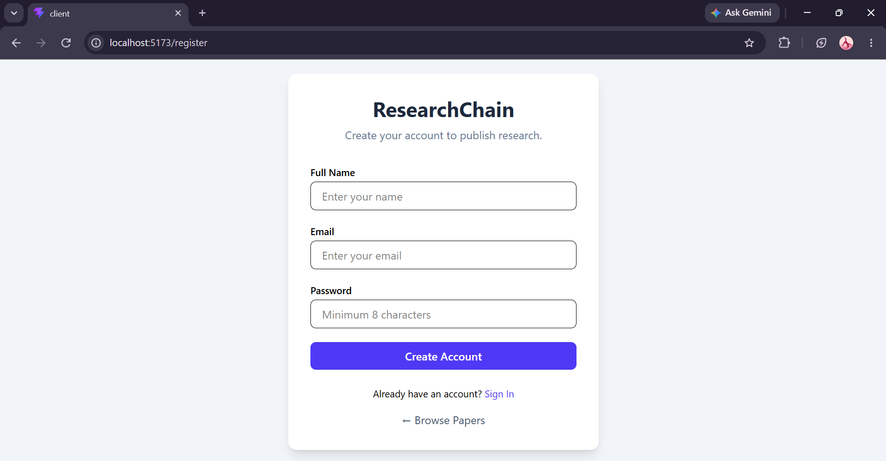
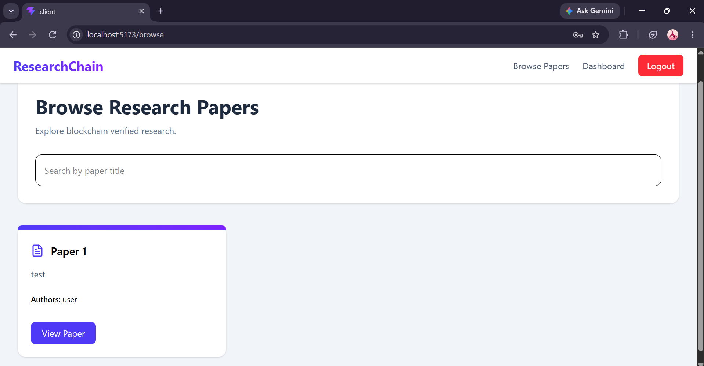
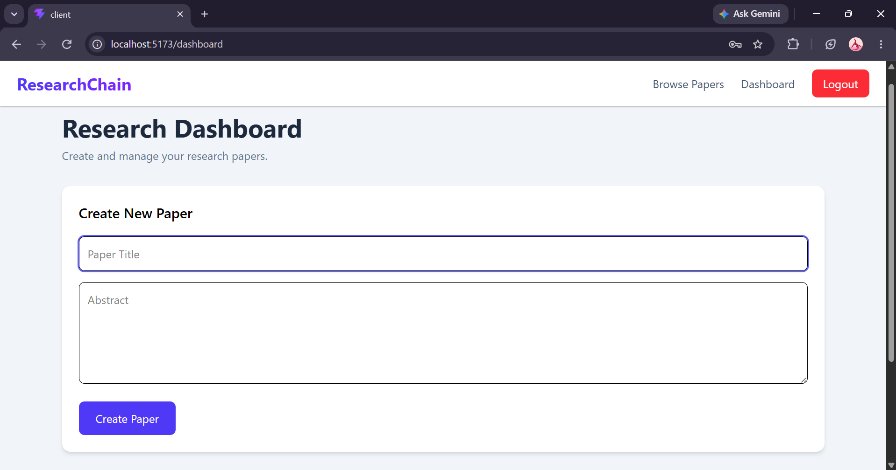
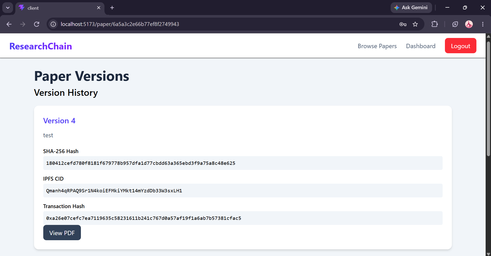

# ResearchChain

ResearchChain is a blockchain-enabled research paper management platform that provides secure publication, version control, and integrity verification for academic research.

---

## Features

- User authentication using JWT
- Create and manage research papers
- Upload multiple versions of a research paper
- Store research PDFs on IPFS
- Generate SHA-256 hash for every uploaded document
- Register paper hash and IPFS CID on Ethereum
- Verify document integrity using blockchain records
- Browse published research papers
- Maintain immutable version history

---

## Architecture

```text
                    +------------------+
                    |     React UI     |
                    +--------+---------+
                             |
                             |
                    REST API (Express)
                             |
        +--------------------+-------------------+
        |                    |                   |
        |                    |                   |
     MongoDB               IPFS            Ethereum
   (Metadata)          (PDF Storage)   (Hash, CID,
                                        Owner,
                                        Timestamp)
```

---

## Tech Stack

### Frontend

- React
- Vite
- Axios
- Tailwind CSS

### Backend

- Node.js
- Express.js
- MongoDB
- Mongoose
- JWT Authentication
- Multer

### Blockchain

- Solidity
- Hardhat
- Hardhat Ignition
- Ethers.js

### Storage

- IPFS (Pinata)

---

## Project Structure

```text
ResearchChain
│
├── client/          React frontend
├── server/          Express backend
├── blockchain/      Solidity smart contracts
└── README.md
```

---

## Smart Contract

The `ResearchRegistry` smart contract stores immutable records for every uploaded research paper.

Each blockchain record contains:

- SHA-256 file hash
- IPFS CID
- Owner wallet address
- Upload timestamp

The blockchain is used solely for integrity verification, while user information, paper metadata, and version details are stored in MongoDB.

---

# Local Deployment

The blockchain uses a **local Hardhat Ethereum node**, allowing transactions and smart contract interactions without deploying to a public blockchain.

---

## 1. Clone the Repository

```bash
git clone https://github.com/arya-alvekar/ResearchChain.git

cd ResearchChain
```

---

## 2. Blockchain

Install dependencies.

```bash
cd blockchain

npm install
```

Start the local Hardhat blockchain.

```bash
npx hardhat node
```

Deploy the smart contract.

```bash
npx hardhat ignition deploy ignition/modules/ResearchRegistryModule.ts --network localhost
```

---

## 3. Backend

Install dependencies.

```bash
cd server

npm install
```

Create a `.env` file.

```env
PORT=<port_no>

MONGO_URI=<your_mongodb_connection_string>

JWT_SECRET=<your_secret>

PINATA_JWT=<your_pinata_jwt>

PRIVATE_KEY=<wallet_private_key>

CONTRACT_ADDRESS=<deployed_contract_address>
```

Run the backend.

```bash
npm run dev
```

---

## 4. Frontend

Install dependencies.

```bash
cd client

npm install

npm run dev
```

The application will be available at

```
http://localhost:5173
```

---

# Screenshots

## Landing Page


---

## Register User



---

## Browse Papers



---


## Dashboard



---

## Paper Versions



---

## Future Improvements

- MetaMask wallet integration
- Research similarity detection
- Citation tracking
- Role-based collaboration between multiple authors
- Advanced search and filtering

---

## License

This project was developed for educational and research purposes.